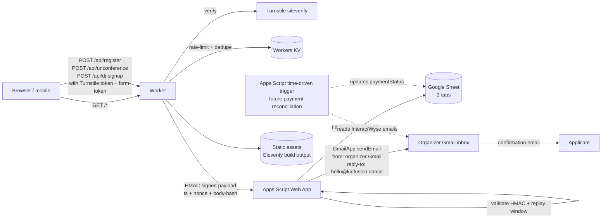

# ADR-001: Kin-Fusion Campout Website Architecture

**Date:** 2026-04-18
**Status:** Accepted
**Decision makers:** Liam Helmer (author); reviewers: local subagent + star-chamber council (OpenAI ×3; failed: nemotron-ultra-253b — auth)

## Context

The Kin-Fusion Campout is a 3-day fusion-dance unconference for ~90 people at Rhizome Springs, Saltspring Island BC, September 11-13 2026 (arrivals Thu Sept 10 / Fri Sept 11; optional Monday Sept 14 departure). The event requires a public website at `kinfusion.dance` that must:

1. Run on Cloudflare's free tier.
2. Use minimal dependencies.
3. Be photo-heavy using 10 existing assets (JPG, PNG, HEIC; some >10 MB).
4. Be easy for non-technical organizers to maintain post-launch.
5. Host three public forms (participant registration, unconference workshop proposal, community DJ signup) whose data lands in a Google Sheet.
6. Communicate sliding-scale pricing ($300 / $350 / $400), scholarships, kids-under-13 free, family-friendly messaging.
7. Accept applications (soft-cap model — organizer triage decides acceptance, payment is out-of-band via Interac e-transfer or Wyse).
8. Coexist with a future, separately-designed Gmail-driven payment reconciliation system.

A research pass (`docs/plans/2026-04-18-kinfusion-website-research.md`) verified the current April 2026 landscape: Cloudflare has converged on Workers + Static Assets (Pages is in maintenance); Astro 6, Eleventy 3.1, and plain HTML are the three realistic SSG candidates; form → Google Sheets has three idiomatic pathways; Turnstile is free; Cloudflare Email Routing handles inbound only; Core Web Vitals and WCAG 2.2 AA are the applicable quality bars.

## Decision

Build the site as an **Eleventy 3.1-generated static site served by a Cloudflare Worker with Static Assets bindings**. The same Worker exposes three JSON POST routes (`/api/register`, `/api/unconference`, `/api/dj-signup`) that validate submissions (Turnstile, honeypot, rate-limit, HMAC-with-replay-protection, idempotency-dedupe) and forward to a **Google Apps Script Web App** bound to the event Google Sheet. The Apps Script writes the row, uses `LockService` to prevent concurrent append races, and sends a confirmation email via `GmailApp` from the organizer's Gmail address (not a `kinfusion.dance` alias — all-Google identity chain to avoid SPF/DKIM/DMARC alignment gaps). The Reply-To header is `hello@kinfusion.dance`, which Cloudflare Email Routing forwards back to the organizer Gmail inbox.

Registration is a **soft-cap application model**: every submission is accepted into an application pool; organizers review and send human-authored acceptance + payment-instruction emails. The site communicates "this is an application, not a ticket" explicitly.

The future payment-reconciliation system is **out of scope for this ADR** but is explicitly designed to co-locate within the same Apps Script project (time-driven trigger reads Interac/Wyse confirmation emails from Gmail, matches by reference code, updates a `paymentStatus` column on the same sheet).

## Requirements (RFC 2119)

### R1. Hosting and deploy

- R1.1 The site MUST be deployed as a single Cloudflare Workers + Static Assets project, configured by one `wrangler.toml`.
- R1.2 The project MUST deploy end-to-end via `wrangler deploy` triggered by a push to `main`.
- R1.3 The project MUST fit inside the Cloudflare free tier for Workers, KV, Turnstile, Email Routing, and DNS.
- R1.4 The Worker MUST serve static assets for all `GET` paths that are not `/api/*`.
- R1.5 The `wrangler.toml` MUST pin a KV namespace used for rate-limiting and idempotency dedupe keys.

### R2. Content and build

- R2.1 The static site generator MUST be Eleventy 3.1.x. Major or minor upgrades MUST NOT be applied until after the event (post-2026-09-14).
- R2.2 Dependency versions MUST be pinned with `package-lock.json` committed to the repo.
- R2.3 Content pages (about, schedule, FAQ, location) MUST be authored in Markdown so non-technical maintainers can edit them via the GitHub web UI.
- R2.4 Layout templates MUST use Nunjucks under `src/_includes/` (base, nav, footer).
- R2.5 The site MUST include at least: `/`, `/about/`, `/location/`, `/schedule/`, `/register/`, `/unconference/`, `/dj/`, `/faq/`.

### R3. Image pipeline

- R3.1 Images MUST be transformed at build time using `@11ty/eleventy-img` 6.x.
- R3.2 The image shortcode MUST emit AVIF, WebP, and JPEG sources with a `<picture>` element and srcset widths of 480, 960, 1440, and 1920 px.
- R3.3 HEIC source files MUST be converted to JPEG before commit; the build MUST NOT attempt HEIC decoding.
- R3.4 The build MUST fail if any source image in `src/assets/` exceeds 12 MB.
- R3.5 The home-page hero (`` for the LCP candidate) MUST set `fetchpriority="high"`; all other images MUST set `loading="lazy"` and `decoding="async"`.
- R3.6 Photos containing clearly identifiable humans SHOULD be used on inner pages with low visual prominence; hero and above-the-fold placements SHOULD prefer landscape/venue/abstract shots.
- R3.7 The site MUST display photos consistent with subject consent obtained by the organizers.

### R4. Forms — client

- R4.1 Each of the three forms MUST be custom HTML (not Google Forms embedded), styled to match the site.
- R4.2 Each form MUST include a Cloudflare Turnstile managed-widget challenge.
- R4.3 Each form MUST include a hidden honeypot field that bots fill but humans don't.
- R4.4 Each form page MUST request a server-issued form-token from `POST /api/form-token` on load; submissions without a valid token MUST be rejected.
- R4.5 The submit button MUST disable on first click and display a "submitting…" state.
- R4.6 If the Turnstile widget fails to load within 5 seconds, the form MUST surface an inline error with a `mailto:hello@kinfusion.dance` fallback.
- R4.7 The form MUST display explicit field labels; `aria-describedby` MUST reference help text where present.
- R4.8 The registration form MUST include a photo/video consent checkbox (opt-in to being photographed at the event).
- R4.9 The registration form MUST include a "I have read and accept the Code of Conduct" required checkbox.
- R4.10 The registration form MUST include a privacy notice and retention statement at the point of data collection.

### R5. Forms — Worker (`/api/*`)

- R5.1 The Worker MUST verify each Turnstile token against Cloudflare's siteverify endpoint before processing the submission.
- R5.2 The Worker MUST reject submissions with a non-empty honeypot field with HTTP 200 and a generic success message (to avoid leaking the honeypot).
- R5.3 The Worker MUST rate-limit submissions to 3 per IP per 60 seconds per form using KV.
- R5.4 The Worker MUST reject submissions whose form-token is missing, expired (>30 min), or previously consumed.
- R5.5 The Worker MUST compute HMAC-SHA256 over `(timestamp, nonce, canonical-body-hash)` using `APPS_SCRIPT_HMAC_KEY` before forwarding to Apps Script.
- R5.6 The Worker MUST compute a dedupe key `SHA256(form || email_lower || canonical-body-hash)` and reject a second submission within 10 minutes with HTTP 200 and a "we already received this" payload.
- R5.7 The Worker MUST return JSON `{ ok: true, refCode }` on success and `{ ok: false, error, code }` with appropriate HTTP status on failure.
- R5.8 The Worker MUST set security headers on all responses: `Content-Security-Policy` (allowlisting `challenges.cloudflare.com` for Turnstile), `Strict-Transport-Security: max-age=31536000; includeSubDomains; preload`, `X-Content-Type-Options: nosniff`, `Referrer-Policy: strict-origin-when-cross-origin`, `Permissions-Policy: interest-cohort=()`.
- R5.9 Worker secrets MUST be set via `wrangler secret put` and MUST NOT be checked into git: `TURNSTILE_SECRET`, `APPS_SCRIPT_URL`, `APPS_SCRIPT_HMAC_KEY`.
- R5.10 The Worker MUST log structured JSON on every rejection (timestamp, form, reason, truncated IP) to `console.log` for Workers tail.

### R6. Forms — Apps Script

- R6.1 The Apps Script Web App MUST validate the HMAC signature, rejecting requests where `abs(serverTime - ts) > 5 minutes` or where the nonce has been seen in the last 10 minutes.
- R6.2 The Apps Script MUST wrap sheet writes in `LockService.getScriptLock()` with a 10-second timeout.
- R6.3 The Apps Script MUST generate a 5-character alphanumeric `refCode` of the form `KF-XXXXX` per submission.
- R6.4 The Apps Script MUST send a confirmation email via `GmailApp.sendEmail()` with:
  - `from`: the organizer Gmail address (default gmail.com; NOT a `kinfusion.dance` alias)
  - `replyTo`: `hello@kinfusion.dance`
  - `subject`: `Kin-Fusion Campout — application received (KF-XXXXX)`
  - body: explicit "this is an application, not a confirmation" language.
- R6.5 The Apps Script MUST expose three handlers keyed on payload `form` field: `register`, `unconference`, `dj-signup`.
- R6.6 Apps Script script properties MUST define: `HMAC_KEY`, `SHEET_ID`, `NONCE_CACHE_MIN`.
- R6.7 The Apps Script source MUST be version-controlled under `apps-script/` and deployable via `clasp push`.
- R6.8 The deployment MUST maintain a separate "staging" Apps Script + Sheet for E2E tests; the Worker MUST select target via `APPS_SCRIPT_URL` per-environment.

### R7. Data model

- R7.1 The Google Sheet MUST have three tabs: `Registrations`, `UnconferenceProposals`, `DJSignups`.
- R7.2 Each registration row MUST include columns: `timestamp`, `refCode`, `fullName`, `email`, `pronouns`, `tier`, `scholarshipRequest`, `scholarshipNote`, `arrivalDay`, `stayMonday`, `kidsUnder13`, `kids13AndOver`, `dietaryNotes`, `accessibilityNotes`, `howDidYouHear`, `photoConsent`, `codeOfConductAccepted`, `status` (initial: `pending-review`), `paymentStatus` (initial: `unpaid`), `notesInternal` (blank).
- R7.3 Free-text fields MUST enforce a server-side max length (500 chars for notes, 100 for names, 200 for "how did you hear").
- R7.4 The `status` lifecycle MUST be: `pending-review` → `accepted` | `waitlisted` | `declined`.
- R7.5 The `paymentStatus` lifecycle MUST be: `unpaid` → `paid` | `refunded`.

### R8. Privacy, retention, and consent

- R8.1 A privacy notice MUST appear at the point of data collection on each form, listing: what data is collected, why, who receives it, retention period, and how to request deletion.
- R8.2 Personal data in the operational Google Sheet MUST be retained for at most 90 days after the event end date (event ends 2026-09-13 → deletion by 2026-12-12).
- R8.3 Before deletion, the sheet MAY be archived to Google Drive with PII columns (fullName, email, pronouns, notes, accessibility) stripped or one-way hashed, retaining only aggregate counts.
- R8.4 The registration form MUST collect explicit photo/video consent (checkbox; separate from registration consent).
- R8.5 Photos published on the site MUST have subject consent; this ADR records that consent has been confirmed for the 10 existing assets (author attests).

### R9. Non-functional

- R9.1 Each page SHOULD achieve mobile Lighthouse performance ≥ 90, accessibility ≥ 95, best-practices ≥ 95, SEO ≥ 95.
- R9.2 Each page SHOULD meet Core Web Vitals thresholds at the 75th percentile: LCP ≤ 2.5 s, INP ≤ 200 ms, CLS ≤ 0.1.
- R9.3 The site MUST be WCAG 2.2 AA compliant per axe-core CI checks on every PR.
- R9.4 Pages not hosting a form MUST ship zero JavaScript.
- R9.5 The home page total weight (HTML + CSS + LCP image) SHOULD be under 500 KB.
- R9.6 The site MUST be usable without JavaScript for content pages (forms may require JS).

### R10. Testing

- R10.1 Playwright E2E MUST cover the golden path of each of the three forms against a staging Apps Script + Sheet before every deploy to production.
- R10.2 Lighthouse CI MUST run on each PR and fail if mobile performance drops below 85 or accessibility below 95.
- R10.3 axe-core accessibility checks MUST run on each PR and fail on WCAG 2.2 AA violations.
- R10.4 Worker unit tests (vitest + miniflare or `wrangler dev --test`) MUST cover: Turnstile verification mock, honeypot rejection, rate-limit behavior, HMAC signing, idempotency dedupe, replay rejection, security-header emission.
- R10.5 A manual pre-launch drill MUST be documented: submit → verify sheet row → verify confirmation email → verify refCode → verify E2E against staging.

### R11. Operations

- R11.1 The operational Google Sheet MUST be backed up weekly to Drive by an Apps Script time-driven trigger (export as XLSX + JSON).
- R11.2 Workers logs MUST be retained via Cloudflare's default log-push or tailed during the registration-opening window.
- R11.3 A runbook MUST exist in `docs/operations/runbook.md` covering: secret rotation, Apps Script redeploy, Turnstile key rotation, sheet restore from backup, incident escalation.
- R11.4 `kinfusion.dance` DNS MUST be managed in Cloudflare; Email Routing MUST forward `hello@`, `info@`, and a catch-all to the organizer Gmail inbox.
- R11.5 Cloudflare Web Analytics (cookieless, free) SHOULD be enabled for traffic monitoring.

### R12. Security — explicit non-goals

- R12.1 The site MUST NOT process payments on-site. Payment occurs out-of-band via Interac e-transfer or Wyse per post-review organizer instructions.
- R12.2 The site MUST NOT store payment card or bank data.
- R12.3 The site MUST NOT expose the Apps Script Web App URL to clients; only the Worker holds it.
- R12.4 The Worker MUST NOT surface detailed internal error messages to clients; generic error codes only.

## Rationale

**Why soft-cap application model (not atomic hard cap).** Payment is out-of-band; even a Worker with an atomic KV counter can't guarantee "paid registration" at submission. Organizer triage enables real curation (scholarships, role/dance balance, kids-space planning) that matches the community-event ethos. A hard-cap design adds complexity without solving the actual reconciliation problem.

**Why Apps Script (not Worker → Sheets API).** The single most important constraint is that organizers (not Liam) own the post-launch form logic and confirmation-email templates. Apps Script lets them edit in Google's editor using an identity they already have — no GCP service account, no `wrangler secret` rotation. The future payment-reconciliation system naturally co-locates in the same Apps Script project, reading Gmail under the organizer's identity and writing the same sheet. A Worker + Sheets API would split this across two trust domains and two editing surfaces.

**Why Eleventy (not Astro, not plain HTML).** Eleventy's Markdown-first model is closer to a non-technical maintainer's mental model than `.astro` files. `@11ty/eleventy-img` handles the photo pipeline (AVIF/WebP/srcset) without Astro's full Vite + `workerd` dev toolchain. Plain HTML was rejected because hand-writing `<picture>` blocks for 10 photos and duplicating nav/footer across 8 pages is strictly more effort than learning Eleventy basics, and CF doesn't support server-side includes. Astro would be the right choice if we needed interactive islands beyond the forms — we don't.

**Why a Worker in front of Apps Script.** Cloudflare Turnstile, IP-based rate-limiting, CSP + security headers, and structured logging belong at the Cloudflare edge. The Apps Script Web App URL must not be publicly POST-able or it becomes a spam vector. HMAC-with-replay-protection ensures the Apps Script rejects anything not freshly signed by our Worker.

**Why all-Google email identity (not Resend).** The star-chamber flagged email deliverability as the highest-risk concern because `GmailApp` sending "as `hello@kinfusion.dance`" requires SPF/DKIM/DMARC alignment on a non-Workspace domain — easy to get wrong. Sending from the organizer's plain Gmail address (with `Reply-To: hello@kinfusion.dance`) side-steps this entirely at the cost of a slightly less-branded From line. The human-authored acceptance + payment-instructions email is also sent from the organizer's Gmail, which has normal deliverability. This keeps the stack all-Google and minimizes vendors. The tradeoff is accepted.

**Why Cloudflare free tier is sufficient.** For ≤90 submissions, 3 forms, no ongoing dynamic traffic beyond form POSTs: Workers 100k req/day (<1% used), KV 1k writes/day (<10% used), Turnstile unlimited free, Email Routing unlimited free, Pages/Workers static assets unlimited bandwidth.

## Alternatives Considered

### A. Worker → Google Sheets API with service account, Durable Object for idempotency

- Pros: strongest soundness, one trust boundary, better observability, future-proof.
- Cons: organizer-owned post-launch edits become dev-owned; GCP project + service account key rotation; reconciliation code has no natural home; confirmation-email stack becomes a separate problem.
- Why rejected: violates primary constraint (organizer-editable post-launch) and splits payment reconciliation off from the form-write system.

### B. Embedded Tally / Google Forms

- Pros: zero backend code; non-technical GUI editing; Google Forms is vendor-risk-free.
- Cons: cannot be styled to match a photo-heavy hand-crafted site; custom validation (sliding-scale tiers, hybrid fields) is limited; Google Forms iframe is visibly Google, mobile-clunky; Tally has real vendor-stability risk on a 6-month-out event.
- Why rejected: user explicitly preferred custom HTML matching site aesthetic; Tally vendor risk is unacceptable for a dated event; Google Forms aesthetic ceiling is too low.

### C. Astro 6 SSG

- Pros: drop-in `<Picture>` component; Cloudflare owns Astro; content collections for MDX.
- Cons: Node 22 + Vite + sharp is the heaviest dep surface; `.astro` files are harder for non-technical maintainers than `.md`; `workerd` dev server has minor rough edges; no interactive islands actually needed beyond forms (which the Worker handles anyway).
- Why rejected: complexity/value tradeoff tips against when Eleventy achieves the same image-pipeline outcome with a smaller surface and Markdown-first content.

### D. Plain HTML + one-shot `scripts/build-images.mjs`

- Pros: minimum dependency surface; no framework churn risk.
- Cons: hand-duplicated nav/footer across 8 pages drifts quickly; hand-written `<picture>` blocks for 10 photos are tedious; no Markdown for long-form content makes non-technical editing worse, not better.
- Why rejected: "minimal dependencies" is a goal but not the *only* goal; Eleventy's dependency cost buys Markdown authoring and templating that directly serve the "maintainable by non-technical organizers" goal.

### E. GmailApp sending from `hello@kinfusion.dance` alias

- Pros: nicer From: line on confirmation emails.
- Cons: requires proper SPF/DKIM/DMARC for `kinfusion.dance` with Gmail as sender, which is non-trivial without Google Workspace; risk of spam-folder placement.
- Why rejected: user chose all-Google simplicity over alias-branded From line.

### F. Resend transactional email provider

- Pros: clean SPF/DKIM/DMARC path for `hello@kinfusion.dance`; free 100/day 3k/month; 10-line HTTP API.
- Cons: third-party vendor dependency; splits email code from the Apps Script where future reconciliation lives.
- Why rejected: user chose to stay all-Google.

## Assumed Versions (SHOULD)

- Eleventy: 3.1 (latest 3.1 patch through event; freeze major/minor after 2026-08-01)
- `@11ty/eleventy-img`: 6.0
- Node (build-time): 22 LTS
- Wrangler: 4
- Cloudflare Workers runtime: current
- Cloudflare Turnstile: managed-mode widget (current)
- Playwright: 1.50+
- axe-core: 4

## Diagram

## Consequences

**Positive:**
- Single-deploy static site + form backend under one `wrangler.toml`.
- Post-launch organizer autonomy: content edits via GitHub web UI; form logic via Google's Apps Script editor.
- Future payment reconciliation lands in the same Apps Script project with zero architectural gymnastics.
- Turnstile + honeypot + rate-limit + HMAC-with-replay + idempotency = defense in depth at the Worker boundary.
- All-Google email chain avoids deliverability complexity while still using a `Reply-To: hello@kinfusion.dance` identity via CF Email Routing.
- Site is fully usable without JavaScript for content pages; form pages progressively enhance.

**Negative:**
- Two deployment surfaces: `wrangler deploy` (site + Worker) and `clasp push && clasp deploy` (Apps Script). Documented in runbook.
- Apps Script debugging is less ergonomic than Worker logs; staging Sheet + explicit E2E drill mitigates.
- HEIC pre-processing is a manual step at content-ingest time; CONTRIBUTING.md + pre-commit hook documentation mitigates.
- Confirmation-email From line is `<something>@gmail.com`, not `hello@kinfusion.dance`; Reply-To preserves the branded address.
- Node 22 + Eleventy + eleventy-img is heavier than plain HTML; lockfile + pinned versions mitigate.

**Out of scope for this ADR (handled separately):**
- Payment reconciliation system (Gmail → sheet `paymentStatus` column).
- Post-event photo gallery / recap.
- Volunteering sign-up (if separated from main registration later).
- Code of Conduct full text (operational; hosted at `/code-of-conduct/` or linked PDF).
- Copy drafting (privacy notice, scholarship text, confirmation email body).

## Council Input

A local subagent generated a candidate question set and the star-chamber (3 OpenAI providers; 1 nemotron provider failed auth) ran in parallel. Both converged on three load-bearing questions: cap enforcement strictness, form backend ownership, and content/build model. The star-chamber additionally promoted "capacity cap strictness" from an assumption to a question (the local subagent had flagged it as an assumption worth challenging).

After synthesis, the star-chamber reviewed the architecture across soundness, version choices, missing concerns, and testability. Accepted findings integrated above: email deliverability (resolved via all-Google identity per user choice); HMAC replay protection (ts + nonce + 5-min window); idempotency + dedupe keys (10-min window, KV); Apps Script `LockService`; Turnstile fallback with `mailto:`; CSP and security headers; PIPEDA privacy notice + photo-consent checkbox + 90-day retention; pinned dependency versions; staging Sheet for E2E; weekly sheet backup.

Rejected findings: migrating to Worker → Sheets API with Durable Object (violates organizer-editability constraint); hybrid Worker-queue → Apps Script async consumer (overbuilt for 90 attendees); Resend transactional email (user chose all-Google).

Versioning recommendations (Node 22 LTS, Eleventy 3.1, Wrangler 4, eleventy-img 6) confirmed sensible by the council. Test suite (Lighthouse CI + axe + Playwright + Worker unit tests with miniflare) endorsed as realistic at this scale.
